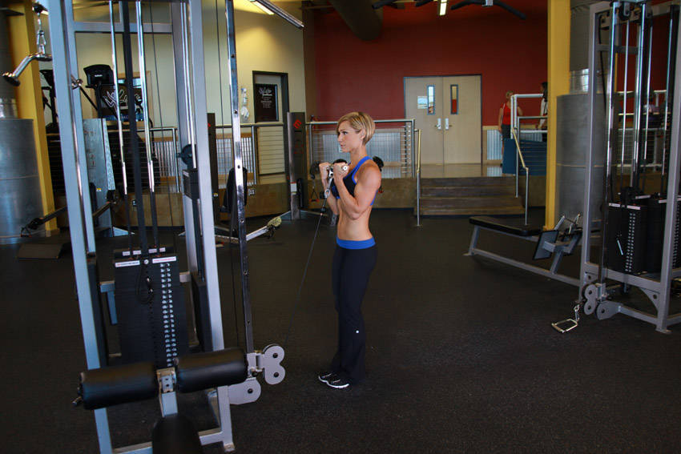
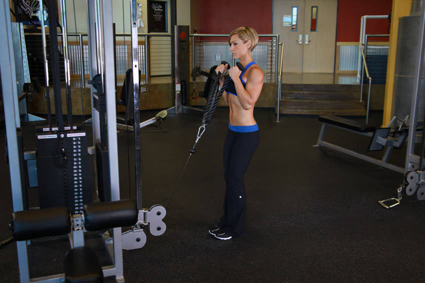
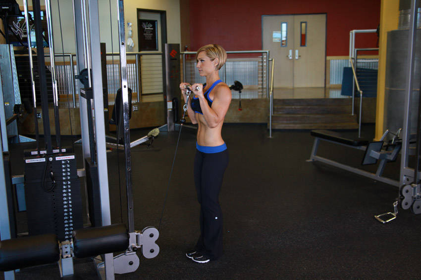
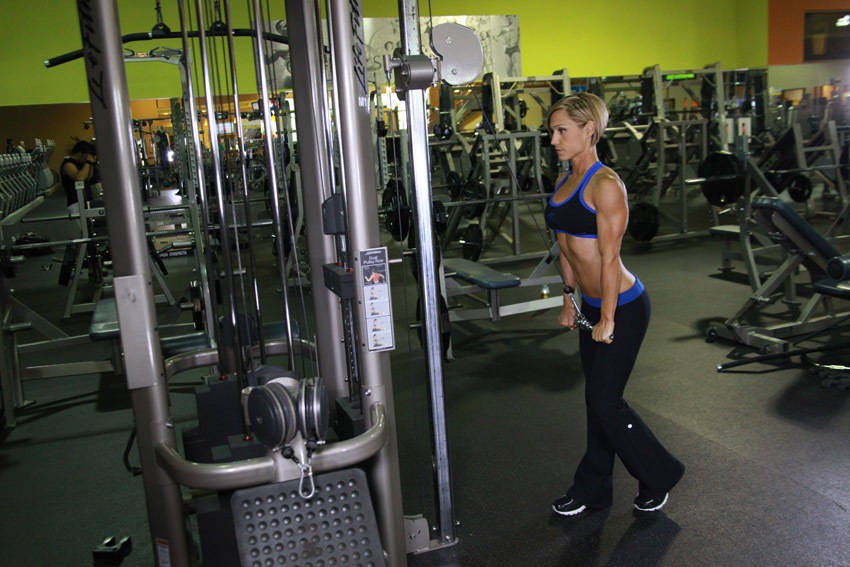
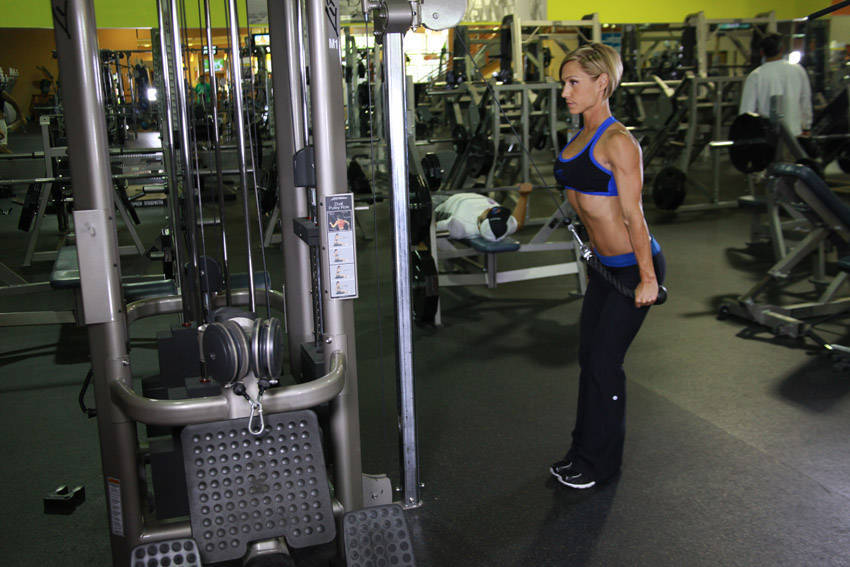
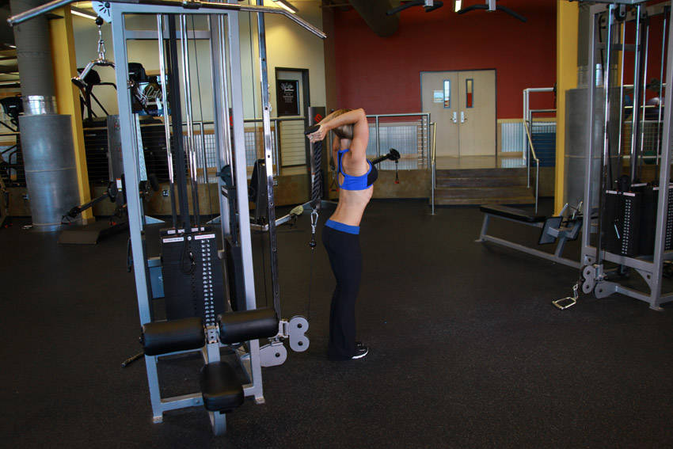

---

title: 手臂动作

date: 2019-06-23 10:42

updated: 2019-06-23 10:42

tags:
- 健身动作要点

categories: 健身

permalink: arm

---

## 简介

记录一下练习肱二头和肱三头的动作以及动作要点。

## 肱二头

### 绳索弯举

- 握距与肩同宽，手肘贴近身体

### 绳索锤式弯举（拉绳）

- 手肘贴近身体

### 绳索弯举（反握）

### 波形杠铃弯举

图略

- 握距与肩同宽

## 肱三头

### 下压

### “拧毛巾”

### 过头顶屈伸

